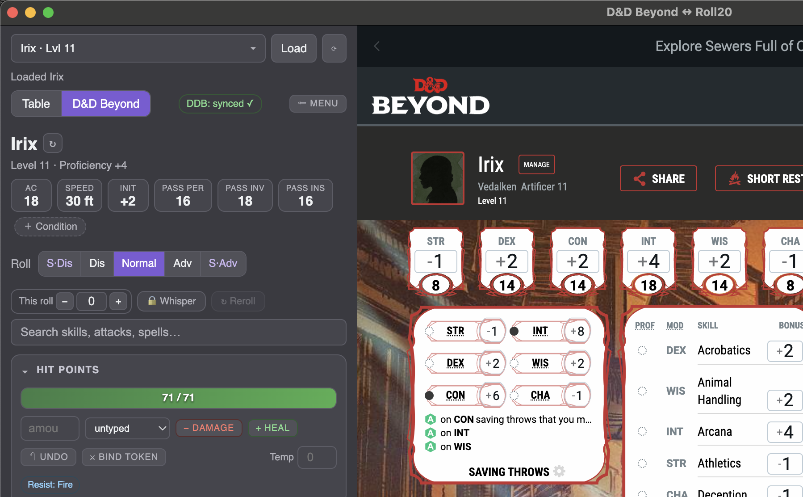
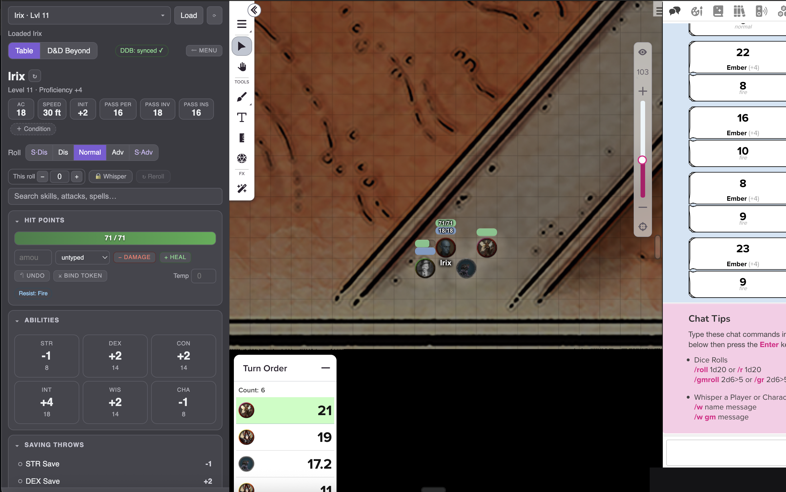
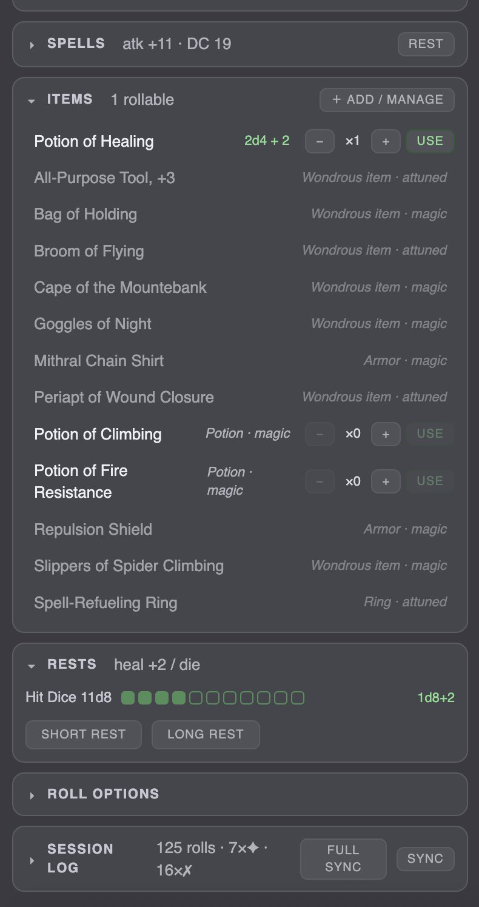

# Conduit

Your character sheet next to your virtual tabletop, in one window — click a roll and it lands in
Roll20, properly formatted. A standalone desktop app, and a spiritual successor to Beyond20.

**Sheet sources:** D&D Beyond · poke5e (Pokémon 5e) · SRD/Open5e + D&D Beyond monsters
**Tabletop:** Roll20

> Free and open source — **GPL-3.0-or-later**.

---

## Get it running

### 1. Download it (easiest)

Grab the installer for your OS from the **[Releases page](https://github.com/dr0v3rr/tabletop-conduit/releases/latest)**:

| Your OS | File |
|---|---|
| macOS (Apple Silicon) | `Conduit-*-arm64.dmg` |
| Windows | `Conduit Setup *.exe` (installer) or `Conduit *.exe` (portable, no install) |
| Linux | `Conduit-*.AppImage` |

Builds are **unsigned**, so the first launch needs one extra click:
- **macOS** — right-click the app → **Open** → **Open**.
- **Windows** — **More info** → **Run anyway**.

### 2. Sign in and go

1. Open Conduit and pick your sheet source (D&D Beyond, poke5e, or Monsters).
2. In the **right pane**, sign into your **Roll20** game — and **D&D Beyond** if that's your source. Logins are remembered.
3. Pick your character (top-left). For poke5e, paste your share link or read key.
4. Open your Roll20 game and **click any roll** — it posts to the chat.

That's it. No accounts to make with us, no server, nothing to configure — Conduit just uses your own logged-in sessions.

### Run from source (developers)

Needs **Node 20+**. Then:

```bash
npm install     # once
npm run shell   # build + launch
```

---

## What it does

**Rolling** — click abilities, saves, skills, initiative, attacks, and spells; they post as proper
Roll20 cards. Set advantage/disadvantage, a one-off modifier, whisper-to-GM, or reroll the last one.

**Two-way with your sheet** — take damage or heal and it writes back (D&D Beyond, or poke5e when you
hold the write key); using a potion decrements it; spending a spell slot marks it used; short/long
rests sync. HP can also drive a matching Roll20 token's bar.

**poke5e trainers** — load a trainer and their Pokémon, roll their moves, and see the trainer's
**path, specialisation, proficiencies, and feats**.

**Pokédex** (poke5e) — browse every species with sprites, stat blocks, moves, and evolutions; filter
by type/region/SR. **Catch** wild Pokémon: throw a Poké Ball, roll Animal Handling with the right
modifiers into Roll20, and add the catch to your poke5e roster. Track what you've **seen** and
**caught**.

**Display in VTT** — push any move, spell, feat, or item's full text to the table so everyone can
read what it does.

**Session log** — a per-player leaderboard (rolls, average d20, crits, fumbles, damage) and a live
feed, filterable by campaign. Every roll is also saved to a durable per-campaign archive so nothing
is lost when Roll20 drops old chat. Export to JSON/CSV anytime.

---

## Screenshots

**D&D Beyond tab** — the rules panel reads your live sheet; the right pane shows your character.



**Table (Roll20) tab** — the same panel with your Roll20 game; clicking a roll posts a formatted card.



**Spells, items, rests, log** — further down: spells, inventory, hit-dice/rests, and the session log.



---

## Tips & troubleshooting

- **Character list is empty.** Sign into D&D Beyond in the right pane first; the list fills in a few
  seconds (or hit **⟳**). Private characters need you signed in.
- **Rolls post as a plain black box.** Your Roll20 game doesn't have the **D&D 5e by Roll20** sheet —
  add it and Conduit switches to the nicer cards automatically.
- **A token's HP won't update.** The Roll20 token must share the character's name and be one you can
  edit.
- **Switching accounts / testing a fresh start.** Use **Sign out** in the top toolbar to wipe the
  saved session.
- **The roll archive lives at** `~/.conduit/roll-logs/` (macOS/Linux) or `%APPDATA%\Conduit\roll-logs\`
  (Windows) — safe to back up.

---

## Building installers

Conduit is packaged with **electron-builder**; output lands in `release/`.

```bash
npm run dist        # installers for the OS you're on
npm run dist:mac    # macOS .dmg + .zip
npm run dist:win    # Windows installer .exe + portable .exe (cross-builds from macOS via Wine)
```

Force specific architectures:

```bash
npm run shell:build && npx electron-builder --mac --universal      # Intel + Apple Silicon
npm run shell:build && npx electron-builder --win --x64
npm run shell:build && npx electron-builder --linux --x64 --arm64
```

**Code signing.** Builds are unsigned — that's why the first launch needs the extra click above.
Proper signing needs a paid Apple Developer ID and/or a Windows code-signing certificate; wire those
into the `build` block in `package.json` if you distribute widely.

Per-release artifacts, checksums, and install notes live in [`docs/RELEASES.md`](docs/RELEASES.md).

---

## Developing

The rules engine (`src/`) is pure TypeScript with no Electron dependency, fully unit-tested
(including a golden test pinned to D&D Beyond's own computed sheet). The app shell is in `electron/`
(`main.ts` = window + web views + IPC; `sheet.ts` = the UI).

```bash
npm run typecheck   # tsc, no emit
npm test            # Vitest
npm run shell       # rebuild + launch to try changes
```

A **TruffleHog** pre-commit hook scans staged changes for secrets — enable it once per clone:

```bash
git config core.hooksPath scripts/git-hooks
```

---

## License

GPL-3.0-or-later.
